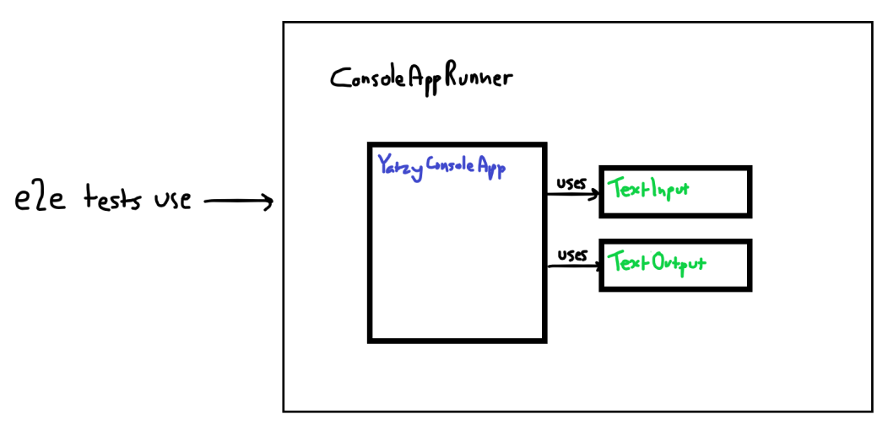

# Yahtzee top down TDD - a short development log

This is a cut down version of my original development log. It's intended to be a
precursor to a publish-able top-down TDD exercise.

This project is an exercise in practicing the top-down or "London School" test-driven
development (TDD) techniques advocated by [Growing Object-Oriented Software Guided by Tests][TDD book].
I'll refer to that text as the 'TDD book' from now on.


# The software

The required software is a console based [Yahtzee][Yahtzee] game. To reduce the time
I spent on this, only some of the game features and rules will be implemented:


The requirements:

- single player
- console/text based
- each turn, the player can either choose a score category, or re-roll
- the player can re-roll all dice up to 3 times per turn
- once a category has been chosen, it cannot be chosen again
- the game finishes when all categories have been chosen


# Getting started - building a 'walking skeleton'

The first step in the process is to find a minimal subset of the given requirements and
implement them, so that the development feedback loop can begin. The [TDD book]
authors refer to this as a 'walking skeleton'. It serves a number of purposes:

- to start the development feedback loop
    - the working application and end-to-end test provide two avenues for feedback
- to start integrating with dependent systems as soon as possible, to identify
  any unknowns / incompatibilities etc.
- to have something to put in your CI/CD pipeline, so that you can get that set up

My Yahtzee walking skeleton will be:

- the smallest possible set of requirements
- a playable console application that fulfils the requirements
- an end-to-end test that verifies the application is correct

For the above, I came up with these initial requirements:


- The game displays the dice roll to the player
- The player chooses a category
- The game displays a score
- The game ends

After a lot more effort than expected, I ended up with this:



- **todo:** There was some refactoring in here. Document if it fits.
- **note:** At this point in development, I hadn't checked the correct spelling
            of Yahtzee :facepalm:

Not pictured, but also included:

- maven config that runs tests & builds the package
- a script to run the game

The only end to end test at this point looks like this:

```java
@Test
public void shouldScoreOneCategoryThenFinish()
{
    var input = new TextInputMock();
    var game = new YatzyConsoleAppRunner(input);
    input.addInputLine("chance");
    game.start();
    game.displayedRoll();
    game.promptedUserForCategory();
    game.displayedScore();
    game.gameIsOver();
}
```

This test is quite different to the tests that I'm used to reading. The assertions are
hidden away in the `YatzyConsoleAppRunner`. As a result, the test essentially reads as
a list of steps in the game.

git tag: `02_better_skeleton`


# Refactor: extract dice

Currently, the game implementation is very simple, and is not easily extendable. That's fine -
it does everything it needs to do to satisfy the current requirements.

**todo:** why did I do this now?? Justify....

```java
public void start() {
    output.writeLine("you rolled: 1, 1, 1, 1, 1");
    output.writeLine("enter a category");
    waitForUserInput();
    output.writeLine("your score: 0");
}

public void waitForUserInput() {
    input.readLine();
}
```

Before moving onto the next requirement, it's pretty obvious that just printing the same dice
roll every time is going to hinder progress very soon. So, I decided to extract it out.


This lets the e2e test control the dice, which looks like this:

```java
@Test
public void shouldScoreOneCategoryThenFinish()
{
    var input = new TextInputMock();
    input.addInputLine("chance");
    final var constantRoll = new Roll(new int[] {1, 1, 1, 1, 1});
    var diceRoller = new ConstantDiceRoller(constantRoll);

    var game = new YatzyConsoleAppRunner(input, diceRoller);

    game.start();
    game.displayedRoll(constantRoll);
    game.promptedUserForCategory();
    game.displayedScore();
    game.gameIsOver();
}
```


# Next feature: calculate score

Currently the game just outputs a score of 0 every time. For this feature, I want to calculate
the score based on the values on the dice. For now, this can be a simple sum of the dice values,
which is how the 'chance' category is scored. For now, I'll do it in `YatzyConsoleApp`:

```java
private int calculateScore(Roll roll) {
    return Arrays.stream(roll.getValues()).sum();
}
```


# Next feature: add a category (yatzy [sic])

The next feature is to add another scoring category, 'Yatzy'. This gives 50 points if all the
dice values are the same, otherwise zero. It's quite obvious (to me) that this is begging for
the strategy pattern, so I decide to extract out a `ScoreCalculatorFactory` and use it in
`YatzyConsoleApp`:

```java
public interface ScoreCalculatorFactory {
    ScoreCalculator calculatorFor(ScoreCategory category);
}
```

and in `YatzyConsoleApp`:

```java
private int calculateScore(Roll roll, ScoreCategory category) {
    var calculator = _scoreCalculatorFactory.calculatorFor(category);
    return calculator.calculateScore(roll);
}
```

The app now looks like this:


At this point, I've got 3 end to end tests:

```java
@Test
public void shouldScoreOneCategoryThenFinish()
{
    var playerInput = new TextInputMock();
    playerInput.addInputLine("chance");
    final var constantRoll = new Roll(new int[] {1, 1, 1, 1, 1});
    var diceRoller = new ConstantDiceRoller(constantRoll);

    var game = new YatzyConsoleAppRunner(playerInput, diceRoller);

    game.start();
    game.displayedRoll(constantRoll);
    game.promptedUserForCategory();
    game.displayedScore(5);
    game.gameIsOver();
}
```

```java
@Test
public void withADifferentRoll_shouldScoreOneCategoryThenFinish()
{
    var playerInput = new TextInputMock();
    playerInput.addInputLine("chance");
    final var constantRoll = new Roll(new int[] {2, 2, 2, 2, 2});
    var diceRoller = new ConstantDiceRoller(constantRoll);

    var game = new YatzyConsoleAppRunner(playerInput, diceRoller);

    game.start();
    game.displayedRoll(constantRoll);
    game.promptedUserForCategory();
    game.displayedScore(10);
    game.gameIsOver();
}
```

```java
@Test
public void whenPlayerChoosesYatzy_shouldGetYatzyScore()
{
    var playerInput = new TextInputMock();
    playerInput.addInputLine("yatzy");
    final var constantRoll = new Roll(new int[] {3, 3, 3, 3, 3});
    var diceRoller = new ConstantDiceRoller(constantRoll);

    var game = new YatzyConsoleAppRunner(playerInput, diceRoller);

    game.start();
    game.displayedRoll(constantRoll);
    game.promptedUserForCategory();
    game.displayedScore(50);
    game.gameIsOver();
}
```


# Todo

- document in 'test first' fashion. Don't show new features before the tests
- How did my approach differ to books eg mini slices decided before
- pick a consistent diagram format


# References

[Growing Object-Oriented Software Guided by Tests][tdd book]

[TDD book]: http://www.growing-object-oriented-software.com/
[Yahtzee]: https://en.wikipedia.org/wiki/Yahtzee