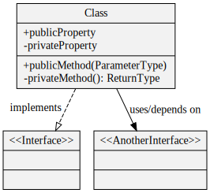

# Evolutionary design, using top-down TDD

Heavily influenced by: 

# Why?

- It's another tool we can use to design our software
- Helps to write domain-focused code and tests
- The resulting end to end tests read like specifications
  of intended application behaviour (eg. BDD/cucumber) -
  which I think we could use more of in our code

# General conventions

In each slide, I add a feature, and cover a red-green-refactor 'round'

<h2 style="color: white; background: red">RED</h2>

`git tag: tagged_commit_around_where_these_changes_happened`

E2E test change to cover the new feature:

```java
public void EndToEndTestForANewFeature() {
    Assert.SomethingHappened();
}
```

- Only end-to-end (E2E) / acceptance test code is shown
- No unit tests are shown (but they're there).

<h2 style="color: white; background: green">GREEN</h2>

Class diagram:



- Only application classes are shown (no tests)

<h2 style="color: black; background: yellow">REFACTOR</h2>

Notes on any refactoring.
