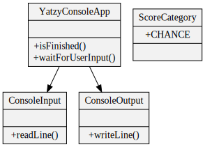

# Feature: Walking skeleton

<h2 style="color: white; background: red">RED</h2>

`git tag: walking_skeleton_red`

End-to-end test:

```java
@Test
public void shouldScoreOneCategoryThenFinish()
{
    var game = new YatzyConsoleAppRunner();
    game.start();
    game.displaysRoll();
    game.playerChoosesCategory(ScoreCategory.CHANCE);
    game.displaysScore();
    game.isFinished();
}
```

<h2 style="color: white; background: green">GREEN</h2>

`git tag: walking_skeleton_green`

End-to-end test:

```java
@Test
public void shouldScoreOneCategoryThenFinish()
{
    var input = new ConsoleInputMock(); // <-- needed way of injecting user input
    var game = new YatzyConsoleAppRunner(input);
    input.addInputLine("chance");       // <-- user input must be set up before game.start()
    game.start();
    game.displayedRollAndPromptedUserForCategory();
    game.displayedScore();
    game.gameIsOver();
}
```

Implementation:



```java
public class YatzyConsoleApp
{
    private final ConsoleInput consoleInput;
    private final ConsoleOutput consoleOutput;

    public static void main(String[] args)
    {
        var app = new YatzyConsoleApp(() -> System.console().readLine(), System.out::println);
    }

    public YatzyConsoleApp(ConsoleInput consoleInput, ConsoleOutput consoleOutput) {
        this.consoleInput = consoleInput;
        this.consoleOutput = consoleOutput;

        consoleOutput.writeLine("you rolled: 1, 1, 1, 1, 1");
        consoleOutput.writeLine("enter a category");
        waitForUserInput();
        consoleOutput.writeLine("your score: 0");
    }

    public boolean isFinished() {
        return true;
    }

    public void waitForUserInput() {
        consoleInput.readLine();
    }
}
```

```java
public class YatzyConsoleAppRunner {
    private YatzyConsoleApp game;
    private ConsoleOutputMock consoleOutput;
    private ConsoleInputMock consoleInput;

    public YatzyConsoleAppRunner(PlayerMock player) {

    }

    public void start() {
        consoleOutput = new ConsoleOutputMock();
        consoleInput = new ConsoleInputMock();
        game = new YatzyConsoleApp(consoleInput, consoleOutput);
    }

    public void displayedRollAndPromptedUserForCategory() {
        assertThat(consoleOutput.readNextLine(), is(equalTo("you rolled: 1, 1, 1, 1, 1")));
        assertThat(consoleOutput.readNextLine(), is(equalTo("enter a category")));
    }

    public void displayedScore() {
        assertThat(consoleOutput.readNextLine(), is(equalTo("your score: 0")));
    }

    public void gameIsOver() {
        assertTrue(game.isFinished());
    }

    public void receivedCategory(ScoreCategory category) {
        game.waitForUserInput();
        var lastInput = consoleInput.getLastLine();
        assertThat(ScoreCategory.fromString(lastInput), is(equalTo(category)));
    }

    public void waitForPlayerInput() {
        consoleInput.readLine();
    }
}
```

<h2 style="color: black; background: yellow">REFACTOR</h2>

`git tag: walking_skeleton_refactored`

Test:

```java
@Test
public void shouldScoreOneCategoryThenFinish()
{
    var input = new TextInputMock();
    var game = new YatzyConsoleAppRunner(input);
    input.addInputLine("chance");
    game.start();
    game.displayedRoll();
    game.promptedUserForCategory();
    game.displayedScore();
    game.gameIsOver();
}
```

Implementation:


