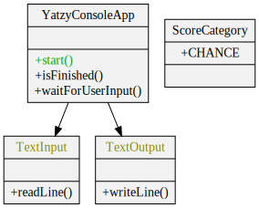

# Feature: Walking skeleton

<h2 style="color: white; background: red">RED</h2>

End-to-end test:

```java
@Test
public void shouldAnswerWithTrue()
{
    var game = new YatzyConsoleAppRunner();
    game.start();
    game.displaysRoll();
    game.playerChoosesCategory(ScoreCategory.CHANCE);
    game.displaysScore();
    game.isFinished();
}
```

<h2 style="color: white; background: green">GREEN</h2>

End-to-end test:

```java
@Test
public void shouldScoreOneCategoryThenFinish()
{
    var input = new ConsoleInputMock();
    var game = new YatzyConsoleAppRunner(input);
    input.addInputLine("chance");
    game.start();
    game.displayedRollAndPromptedUserForCategory();
    game.displayedScore();
    game.gameIsOver();
}
```

Implementation:


<h2 style="color: black; background: yellow">REFACTOR</h2>

Test:

```java
@Test
public void shouldScoreOneCategoryThenFinish()
{
    var input = new TextInputMock();
    var game = new YatzyConsoleAppRunner(input);
    input.addInputLine("chance");
    game.start();
    game.displayedRoll();
    game.promptedUserForCategory();
    game.displayedScore();
    game.gameIsOver();
}
```

Implementation:

