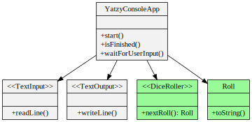
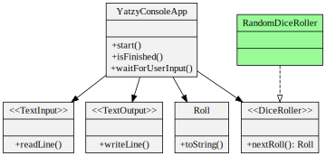

# Feature: Show real dice roll

<h2 style="color: white; background: red">RED</h2>

`git tag: dice_red`

End-to-end test:

```java
@Test
public void shouldScoreOneCategoryThenFinish()
{
    var input = new TextInputMock();
    var game = new YatzyConsoleAppRunner(input);
    input.addInputLine("chance");
    game.start();
    var nextDiceRoll = new Roll(new int[] {1, 1, 1, 1, 1}); // <-- added
    game.rollDice(nextDiceRoll);                            // <-- added
    game.displayedRoll(nextDiceRoll);                       // <-- added
    game.promptedUserForCategory();
    game.displayedScore();
    game.gameIsOver();
}
```

Another e2e test:

```java
@Test
public void withADifferentRoll_shouldScoreOneCategoryThenFinish()
{
    var input = new TextInputMock();
    var game = new YatzyConsoleAppRunner(input);
    input.addInputLine("chance");
    game.start();
    var nextDiceRoll = new Roll(new int[] {2, 2, 2, 2, 2});
    game.rollDice(nextDiceRoll);
    game.displayedRoll(nextDiceRoll);
    game.promptedUserForCategory();
    game.displayedScore();
    game.gameIsOver();
}
```

<h2 style="color: white; background: green">GREEN</h2>

`git tag: dice_green`

End-to-end test change:

```java
@Test
public void shouldScoreOneCategoryThenFinish()
{
    var input = new TextInputMock();
    var game = new YatzyConsoleAppRunner(input);
    input.addInputLine("chance");
    var nextDiceRoll = new Roll(new int[] {1, 1, 1, 1, 1}); // <-- set dice roll before game start
    game.setNextDiceRoll(nextDiceRoll);                     // <-- add ability to set dice rolls
    game.start();
    game.displayedRoll(nextDiceRoll);
    game.promptedUserForCategory();
    game.displayedScore();
    game.gameIsOver();
}
```

Implementation:



<h2 style="color: black; background: yellow">REFACTOR</h2>

`git tag: dice_refactored`

End-to-end test change:

```java
@Test
public void shouldScoreOneCategoryThenFinish()
{
    var input = new TextInputMock();
    input.addInputLine("chance");
    final var constantRoll = new Roll(new int[] {1, 1, 1, 1, 1});
    var diceRoller = new ConstantDiceRoller(constantRoll);   // <-- add DiceRoller stub

    var game = new YatzyConsoleAppRunner(input, diceRoller); // <-- inject diceRoller instead of setNextDiceRoll

    game.start();
    game.displayedRoll(constantRoll);
    game.promptedUserForCategory();
    game.displayedScore();
    game.gameIsOver();
}
```

Implementation:



# todo
- show YatzyConsoleAppRunner once at start
- show YatzyConsoleApp once at start