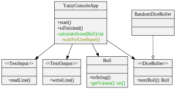

# Feature: Score the dice roll

<h2 style="color: white; background: red">RED</h2>

`git tag: score_roll_red`

End-to-end test:

```java
@Test
public void shouldScoreOneCategoryThenFinish()
{
    var input = new TextInputMock();
    input.addInputLine("chance");
    final var constantRoll = new Roll(new int[] {1, 1, 1, 1, 1});
    var diceRoller = new ConstantDiceRoller(constantRoll);

    var game = new YatzyConsoleAppRunner(input, diceRoller);

    game.start();
    game.displayedRoll(constantRoll);
    game.promptedUserForCategory();
    game.displayedScore(5);                     // <-- check for expected score
    game.gameIsOver();
}
```

<h2 style="color: white; background: green">GREEN</h2>

`git tag: score_roll_green`



<h2 style="color: black; background: yellow">REFACTOR</h2>

No refactoring this round.
