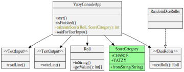
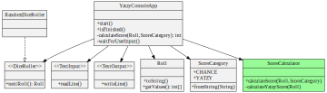

# Feature: Add a score category - 'Yatzy'

<h2 style="color: white; background: red">RED</h2>

`git tag: add_category_red`

New end-to-end test:

```java
@Test
public void whenPlayerChoosesYatzy_shouldGetYatzyScore()
{
    var playerInput = new TextInputMock();
    playerInput.addInputLine("yatzy");          // <-- player chooses yatzy category
    final var constantRoll = new Roll(new int[] {3, 3, 3, 3, 3});
    var diceRoller = new ConstantDiceRoller(constantRoll);

    var game = new YatzyConsoleAppRunner(playerInput, diceRoller);

    game.start();
    game.displayedRoll(constantRoll);
    game.promptedUserForCategory();
    game.displayedScore(50);                    // <-- expected yatzy score
    game.gameIsOver();
}
```

<h2 style="color: white; background: green">GREEN</h2>

`git tag: add_category_green`



<h2 style="color: black; background: yellow">REFACTOR</h2>

`git tag: add_category_refactor_1`


