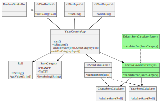
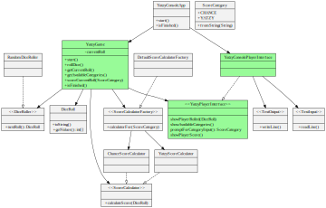

# Bonus refactoring round: Extract Game class

<h2 style="color: black; background: yellow">REFACTOR</h2>

For easier comparison, here's the previous state:

`git tag: add_category_refactor_3`

`git tag: extract_game_end`

