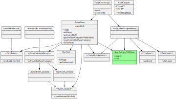

# Feature: Display score with available categories

<h2 style="color: white; background: red">RED</h2>

`git tag: display_score_with_category_red`

Change to all end-to-end tests:

```java
@Test
public void shouldScoreOneCategoryThenFinish()
{
    var playerInput = new TextInputMock();
    playerInput.addInputLine("chance");
    final var constantRoll = new DiceRoll(new int[] {1, 1, 1, 1, 1});
    var diceRoller = new ConstantDiceRoller(constantRoll);

    var game = new YatzyConsoleAppRunner(playerInput, diceRoller);

    game.start();
    game.displayedRoll(constantRoll);
    game.displayedAvailableCategories(new ScoreCategoryWithScore[] {  // <-- expect scores with categories
            new ScoreCategoryWithScore(ScoreCategory.CHANCE, 5),
            new ScoreCategoryWithScore(ScoreCategory.YATZY, 50)
    });
    game.promptedUserForCategory();
    game.displayedScore(5);
    game.gameIsOver();
}
```

<h2 style="color: white; background: green">GREEN</h2>

`git tag: display_score_with_category_green`



<h2 style="color: black; background: yellow">REFACTOR</h2>

No refactoring this round. I did add some unit tests for `YatzyGame`.
