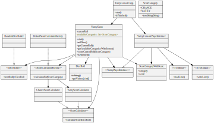

# Feature: Game ends when all categories are chosen

<h2 style="color: white; background: red">RED</h2>

`git tag: end_when_no_categories_red`

End-to-end test:

```java
@Test
public void shouldScoreOneCategoryThenFinish()
{
    final var constantRoll = new DiceRoll(new int[] {1, 1, 1, 1, 1});
    var diceRoller = new ConstantDiceRoller(constantRoll);
    var player = new YatzyPlayerMock();

    player.addNextInput(ScoreCategory.CHANCE);
    player.addNextInput(ScoreCategory.YATZY);

    var game = new YatzyConsoleAppRunner(player.textInput(), diceRoller);
    game.start();

    // turn 1
    game.displayedRoll(constantRoll);
    game.displayedAvailableCategories(new ScoreCategoryWithScore[] {
            new ScoreCategoryWithScore(ScoreCategory.CHANCE, 5),
            new ScoreCategoryWithScore(ScoreCategory.YATZY, 50)
    });
    game.promptedUserForCategory();
    game.displayedScore(5);

    // turn 2
    game.displayedRoll(constantRoll);
    game.displayedAvailableCategories(new ScoreCategoryWithScore[] {
            new ScoreCategoryWithScore(ScoreCategory.YATZY, 50)
    });
    game.promptedUserForCategory();
    game.displayedScore(50);

    game.gameIsOver();
}
```

Note: this is the only e2e test at this point. Does it cover all implemented features? Let's check:

- [x] display roll
- [x] prompt for category
- [x] score the roll
- [x] display score
- [x] include multiple categories
- [x] display potential scores with categories
- [x] game is over when all categories are chosen

<h2 style="color: white; background: green">GREEN</h2>

`git tag: end_when_no_categories_green`



<h2 style="color: black; background: yellow">REFACTOR</h2>
