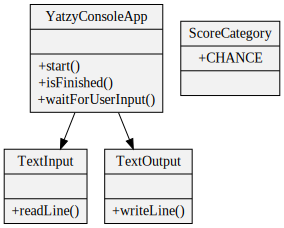

# The walking skeleton

As described in the [intro](/pages/00_intro.html), I want to make a console
based Yahtzee game.

The first step in the process is to look at the requirements for the
application, and work out the smallest possible application that can satisfy one
of the requirements, or at least part of a requirement. This initial, bare-bones
application will start the TDD process, allowing me to grow the application into
its final required state, usings tests to guide me. The [TDD book][1] authors
refer to this initial application as a 'walking skeleton'. It serves a number of
purposes:

- to start the development feedback loop
- to start integrating with dependent systems as soon as possible, to identify
  any unknowns / incompatibilities etc.
- to have a software artifact to use in a CI/CD pipeline

Since this is a simple console application with no external dependencies, and I
have no need for a build pipeline, only the first purpose is important. For my
walking skeleton, I came up with these initial requirements:

- The game displays the dice roll to the player
- The player chooses a category
- The game displays a score
- The game ends

Also, in the absence of a build pipeline, I want an easy way for me (and other
developers) to run the tests, and the application itself.


# The first test

Now that the 'walking skeleton' requirements have been determined, I need to
express them as an acceptance test. This is the rule with any form of TDD: The
test comes first, it fails, we fix it, then clean things up. This is more well
known as 'red, green, refactor'.

git tag: `walking_skeleton_red`

```java
@Test
public void shouldScoreOneCategoryThenFinish()
{
    var game = new YatzyConsoleAppRunner();
    game.start();
    game.displaysRoll();
    game.playerChoosesCategory(ScoreCategory.CHANCE);
    game.displaysScore();
    game.isFinished();
}
```

The above test is in a similar style to that used in the [TDD book][1]. It is
quite different to the tests that I'm used to reading. I'm very used to
low-level tests of class behaviour, usually with a setup block, an 'act' block,
and an assertion or two at the end. This test reads almost exactly like the list
of requirements. This is made possible by `YatzyConsoleAppRunner`, which hides
the game setup and assertions.

**Note:** At this point in development, I hadn't checked the correct spelling
          of Yahtzee :facepalm:

    git tag: `walking_skeleton_green`

After trialling a few ways to make console input and output testable, I settled
on the following design, and got the test passing.


It turned out to be hard to make the acceptance test run as written above, so I
had to change it a little:

```java
@Test
public void shouldScoreOneCategoryThenFinish()
{
    var input = new ConsoleInputMock();
    var game = new YatzyConsoleAppRunner(input);
    input.addInputLine("chance");
    game.start();
    game.displayedRollAndPromptedUserForCategory();
    game.displayedScore();
    game.gameIsOver();
}
```

It was going to be too much hassle to be able to insert the player input at the
step it was needed, so the line `input.addInputLine("chance");` adds the player
input at the start of the test. I also needed to create a `ConsoleInputMock()`
and pass it to the app runner, so that the test had control over the player's
input.

`YatzyConsoleAppRunner` looks like this:

```java
public class YatzyConsoleAppRunner {
    private YatzyConsoleApp game;
    private ConsoleOutputMock consoleOutput;
    private ConsoleInput consoleInput;

    public YatzyConsoleAppRunner(ConsoleInput input) {
        consoleInput = input;
    }

    public void start() {
        consoleOutput = new ConsoleOutputMock();
        game = new YatzyConsoleApp(consoleInput, consoleOutput);
    }

    public void displayedRollAndPromptedUserForCategory() {
        assertThat(consoleOutput.readNextLine(), is(equalTo("you rolled: 1, 1, 1, 1, 1")));
        assertThat(consoleOutput.readNextLine(), is(equalTo("enter a category")));
    }

    public void displayedScore() {
        assertThat(consoleOutput.readNextLine(), is(equalTo("your score: 0")));
    }

    public void gameIsOver() {
        assertTrue(game.isFinished());
    }
}
```

The application itself, `YatzyConsoleApp` does only what it needs to in order
to pass the acceptance test. This is an important rule of TDD, and prevents
over-engineering:

```java
public class YatzyConsoleApp
{
    private final ConsoleInput consoleInput;
    private final ConsoleOutput consoleOutput;

    public static void main(String[] args)
    {
        var app = new YatzyConsoleApp(() -> System.console().readLine(), System.out::println);
    }

    public YatzyConsoleApp(ConsoleInput consoleInput, ConsoleOutput consoleOutput) {
        this.consoleInput = consoleInput;
        this.consoleOutput = consoleOutput;

        consoleOutput.writeLine("you rolled: 1, 1, 1, 1, 1");
        consoleOutput.writeLine("enter a category");
        waitForUserInput();
        consoleOutput.writeLine("your score: 0");
    }

    public boolean isFinished() {
        return true;
    }

    public void waitForUserInput() {
        consoleInput.readLine();
    }
}
```

git tag: `walking_skeleton_refactored`

Then I refactored:



since the text inputs weren't necessarily related to a console

for the tests:

displayedRollAndPromptedUserForCategory was obvious: don't want "and" in a method
displayedRoll
promptedUserForCategory

```java
@Test
public void shouldScoreOneCategoryThenFinish()
{
    var input = new TextInputMock();
    var game = new YatzyConsoleAppRunner(input);
    input.addInputLine("chance");
    game.start();
    game.displayedRoll();
    game.promptedUserForCategory();
    game.displayedScore();
    game.gameIsOver();
}
```


# Additional niceties

A maven config that runs tests & builds the package. This came for free when
setting up the project. A user can run all tests and build the package by running
`mvn package`.

A script to run the game. Rather than having to remember
`java -jar target/yatzy-1.0-SNAPSHOT.jar` to run the game, I added a `run_game`
script.

A readme describing the above. By reading this, a new developer should have everything
they need to get started developing and testing the project.

Now would be the time to add a build pipeline, but this is out of scope for this exercise.


[1]: http://www.growing-object-oriented-software.com/
